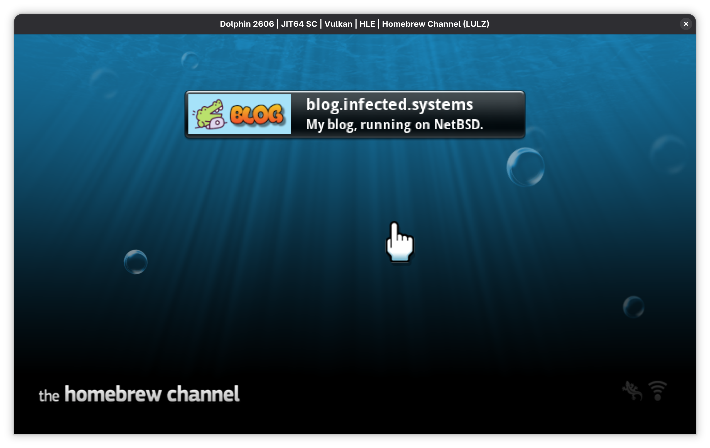

# blog.infected.systems

My [blog](https://blog.infected.systems).



### Build dependencies
Just `podman`.

### Production build
Builds a full Nintendo Wii NetBSD SD card image from source, injecting the site during the build process (yes, really):

```sh
./wii.sh
```

After the build completes, `nintendo.img.gz` can be written to an SD card using Raspberry Pi Imager and booted on any Wii with The Homebrew Channel installed.

In theory the same image ought to boot on a Wii U too, though I don't have one so I haven't been able to test it.

If you want to tweak this for your own uses, all of the customisation lives in `nintendo.conf` in this repo.

You may also want to tweak the `Containerfile` a bit since most of the build happens inside `tmpfs` so the build process alone needs about 10GB of free RAM and will probably break otherwise.

### Quick build
To build just the site and sync it to an already-installed system:

```sh
cd site
./build-and-sync.sh
```
