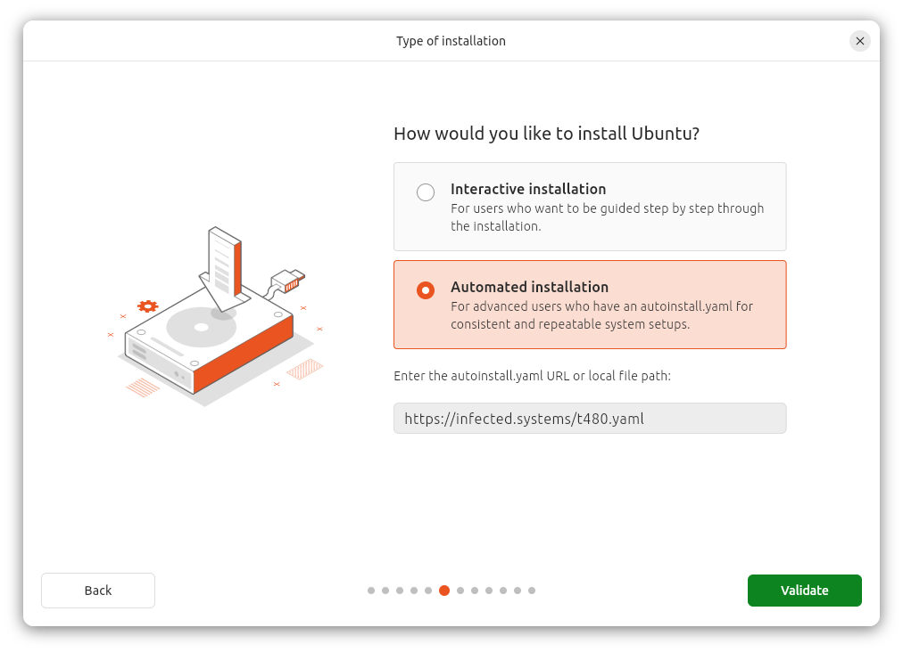

+++
title = 'Reinstalling my laptop with Ubuntu autoinstall'
date = 2024-10-22T18:00:00Z
draft = false
summary = "Another day, another attempt at managing desktop Linux as if it was the cloud."
tags = ['ubuntu', 'linux']
+++

I've recently been playing with using Ubuntu's [autoinstall](https://canonical-subiquity.readthedocs-hosted.com/en/latest/intro-to-autoinstall.html) feature to reinstall a few Ubuntu Desktop machines. It has what I think is a very user-friendly flow so I thought I'd write a bit about it.

### What?
Ubuntu's autoinstall allows us to pass a YAML file which defines all the options we want to install our system with directly to the Ubuntu installer. It's something I've been using for quite a while to automate installs from the Ubuntu Server ISO -- including desktop installs which you can actually perform from the Server ISO if you install the right set of metapackages.

Canonical recently made this feature much more accessible to Ubuntu Desktop users by adding a screen that allows feeding an autoinstall YAML to the installer from a URL. (Okay, I might be fairly late to the party on this one, but this feature only landed in a Long Term Support release this year).



But wait... passing a YAML file to a system to configure it during install?

If you're familiar with `cloud-init`, this is all probably sounding quite familiar. But, alas, `autoinstall` is not _quite_ `cloud-init`. There's definitely a lot of overlap in structure and naming scheme, but they're (slightly) different beasts.

I don't think this is something that the documentation makes adequately clear and I found myself struggling through a lot of different docs and forum posts while trying to piece together working configs in the past. One of the things I like when experimenting with a new feature is when guides and tutorials provide a _complete, working_ example I can work back from, rather than a set of jigsaw pieces that need fitting together. With that in mind, you can scroll to the bottom of this post or [look here](https://infected.systems/t480.yaml) for a fully working example that I used to reinstall the laptop I'm writing this post on.

### Why?
#### Reproducibility
It's nice to have a system config that's reproducible. This might be a bit less important when it comes to a desktop system -- compared to installing hundreds of identical VMs or servers for a distributed deployment -- but it's still nice.

#### Declarative(ish) system config
Having a declarative config allows for the predictable state of the system after install. I use a lot of systems and, wherever possible, I try and manage them as code. After install, I manage any non-atomic* Linux distributions through their lifecycle using Ansible, which ends up being my documentation for how the system is configured. It's nice to be able to extend that notion of code-as-documentation to the initial state of the system, so I can always reference the code that originally produced a system to learn more about it.

*Atomic distributions are a whole different rabbit hole of their own, and one which I _thoroughly_ expect to explore on here at some point.

#### Cloud-native approach
It might not _quite_ be `cloud-init`, but the concepts behind seeding an installer with a declarative idea of what you want the state of a system to be after install is definitely going to be pretty familiar to anyone who has done any cloud admin in recent years, and it's nice to have that consistency between environments.

### Old and busted
In order to appreciate the user-friendliness of what Canonical has bestowed upon us here, I present this snippet from a [Hashicorp Packer](https://www.packer.io/) file that I've used in the past to help build Ubuntu Desktop VMs for development usage:

```hcl
  boot_wait = "7s"
  boot_command = [
    "e<wait>",
    "<down><down><down><wait>",
    "<end><wait>",
    " autoinstall<wait>",
    "<leftCtrlOn><x><leftCtrlOff>"
  ]
```

Unfortunately, that's exactly what it looks like... it waits for a hard-coded 7 seconds before starting to inject the keystrokes into the VM required to tell the installer to look for an autoinstall YAML file on another drive attached to the VM and use it.

That might not be the cleanest way of achieving the autoinstall goal, but even the cleaner method involves taking apart the installer ISO and rebuilding it with the autoinstall YAML inside and changes to the GRUB config.

The new functionality of being able to type the YAML URL directly into the installer is one I'm definitely appreciating.

### New hotness
Rather than spend a while repeating the documentation at you in small chunks, this is the (entire) working file that I used to install this ThinkPad T480. It installs using encrypted root-on-ZFS, with a bunch of packages and Snaps and some minor other configuration.

Hopefully it serves as a useful starting point to configure further.

Please be aware that if you use this file directly and you have a drive at `/dev/nvme0n1` it **will be wiped**, so I can't encourage using this without editing it!

Similarly, I host this file on the public internet [here](https://infected.systems/t480.yaml) for easy access during install. For this reason, the default encryption and user passwords are just `password` and I rotate them after install. I'd recommend doing similar if you host your YAML file anywhere public. There are some instructions in the comments of the file on rotating the password used for disk encryption.

#### Fully working example
```yaml
autoinstall:
  version: 1

  source:
    id: ubuntu-desktop-minimal

  locale: en_GB.UTF-8
  keyboard:
    layout: us  # Typically would use 'gb' but my T480 has a US keyboard
  timezone: Europe/London

  storage:
    layout:
      name: zfs
      # Ubuntu uses a ZFS keyfile to unlock the main pool.
      # This keyfile is stored on a LUKS volume which is actually a ZFS ZVOL that's kept at `rpool/keystore`.
      # Thus, to change the ZFS unlock password after install, we need to use:
      #     sudo cryptsetup luksChangeKey /dev/zvol/rpool/keystore
      # on the installed and booted system.
      password: password  # LUKS2 password - will need rotating post-install
      match:
        path: /dev/nvme0n1

  identity:
    hostname: t480
    username: user
    password: "$6$AEzzJzqYSLoOU..B$9eBMwzAStDHZaHlNPrjJ12zq2WkHVgpmTsGbuxEdQzCOKKTN1wXKzrBLjazOavFb6u19jWALrCyEqBW9rzTNA0"  # 'password'

  # This ssh daemon config gets written to /etc/ssh/sshd_config.d/50-cloud-init.conf on the installed system
  ssh:
    install-server: true
    allow-pw: false
    authorized-keys: []

  packages:
    - distrobox               # universe
    - flatpak                 # universe
    - git                     # main
    - podman                  # universe
    - ufw                     # main
    - unattended-upgrades     # main
    - wireshark               # universe

  snaps:
    - name: bitwarden
    - name: libreoffice

  late-commands:
    # Configure unattended-upgrades to upgrade all packages when it runs (not just security updates)
    # Normally we'd invoke this with the -e flag but for some reason if we do that then the -e flag
    # ends up being treated as part of the string and echoed into the destination file
    - echo 'Unattended-Upgrade::Origins-Pattern {\n        "origin=*";\n};\n\nUnattended-Upgrade::Package-Blacklist {\n};' | /usr/bin/tee /target/etc/apt/apt.conf.d/50unattended-upgrades
    # Remove desktop update notifier application
    - curtin in-target --target=/target -- apt-get purge -y --quiet=2 update-notifier update-notifier-common
    # Clean up apt with an autoremove and clean
    - curtin in-target --target=/target -- apt-get autoremove -y --quiet=2 --purge
    - curtin in-target --target=/target -- apt-get clean
    # Enable Flathub
    - curtin in-target --target=/target -- flatpak remote-add --if-not-exists flathub https://dl.flathub.org/repo/flathub.flatpakrepo
    # Configure UFW on the target system with a basic default of only ingress SSH being allowed
    - curtin in-target --target=/target -- ufw --force reset
    # We need to run the following commands inside chroot instead of curtin because they depend on
    # inserting the ip6_tables kernel module in order to successfully run and that module doesn't
    # seem to actually ship on the ISO inside the installer environment. So we chroot into our
    # installed system where we definitely have the module available in order to run these commands.
    - chroot /target /usr/sbin/ufw limit ssh
    - chroot /target /usr/sbin/ufw enable
```
