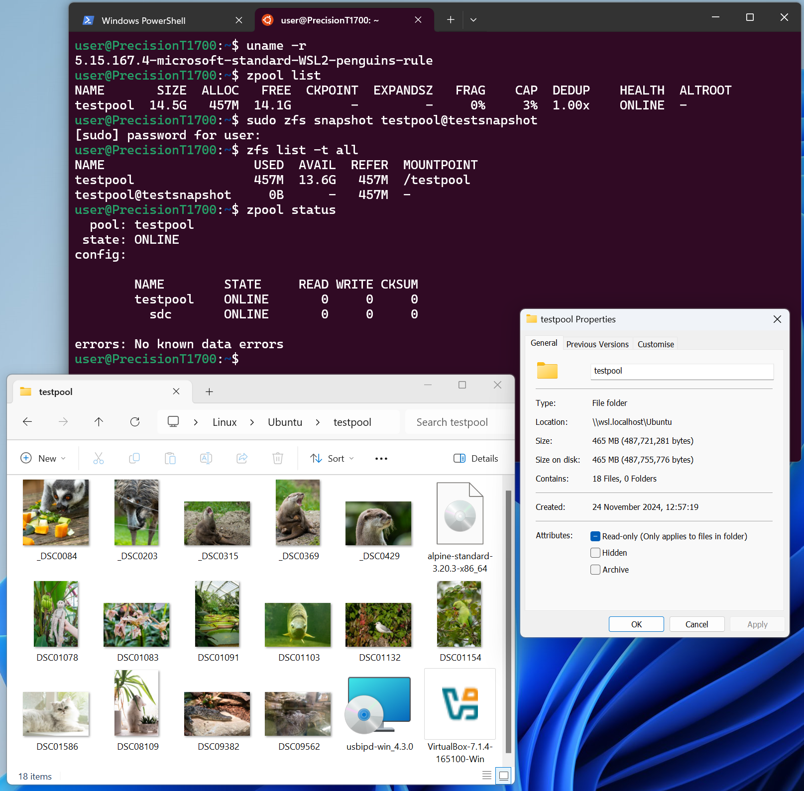

+++
title = 'Reading ZFS drives on Windows with the power of WSL'
date = 2024-11-24T11:30:00Z
draft = false
+++

I recently found myself in a situation where I needed to read a ZFS-formatted drive, but with only a Windows machine to-hand.

Now I _could_ walk across the room and simply grab a device running a more penguin-oriented operating system. But that's no fun. So I decided the optimal course of action would be to spend the afternoon learning about WSL internals and recompiling the Linux kernel several times until I had the drive working directly on Windows.

With some minor effort, it's definitely possible to get Windows reading and writing ZFS drives, and exposing their contents through Windows Explorer as if they are native:



We can even use snapshots, bookmarks and all the other features ZFS normally provides!

### OpenZFS on Windows

There is a native port of ZFS for Windows which is actively developed, called [OpenZFS on Windows](https://github.com/openzfsonwindows/openzfs). I can't comment on the quality of this code as I haven't tried it, but it seems to be in quite an early 'alpha' stage to me. I decided that, if possible, I'd rather use the much more mature Linux codebase to mount my drive.

### zfsutils-linux
My first brainwave was simply to try installing the `zfsutils-linux` package inside a standard WSL Ubuntu session and try and mount the ZFS pool inside of WSL. On a full Ubuntu install, this package is usually all we need to get full ZFS functionality.

Unfortunately, this doesn't work for WSL. As it turns out, the `zfsutils-linux` package only contains the userspace binaries that allow interacting with ZFS pools, such as `zpool`, `zfs`, `zdb`, etc. It doesn't contain the actual kernel code required to support ZFS filesystems.

On Debian systems, these modules get built on the end user machine automatically [by the `zfs-dkms` package](https://packages.debian.org/bookworm/zfs-dkms). In Ubuntu things are sightly different. Canonical build the modules themselves in their build infrastructure and ship them with kernel updates directly. This allows them to do things like sign the kernel image for Secure Boot _after_ the ZFS modules are included. From what I can tell, Canonical's modules get built form the same `zfs-dkms` code, as you can [see where they include it in their kernel build here](https://git.launchpad.net/~ubuntu-kernel/ubuntu/+source/linux/+git/noble/tree/debian/scripts/dkms-build-configure--zfs).

Unfortunately for us, when we install the default Ubuntu distribution inside WSL, it doesn't use Canonical's kernel, it uses [a Microsoft one, tailored specifically for WSL](https://github.com/microsoft/WSL2-Linux-Kernel).

### Solution
Overall, the solution to this ends up being relatively simple. WSL2 allows us to specify a path to a custom-built kernel using the `.wslconfig` file. With that in mind, we can pull the sources from the Microsoft WSL2 kernel repo above, rebuild them with OpenZFS support statically baked-in, and then reconfigure WSL to use our new custom kernel.

### Build instructions
I built a script to automate this process, which is hopefully fairly well commented. You can find that [over on GitHub here](https://github.com/alexhaydock/zfs-on-wsl).

Once the script is downloaded _into the WSL Ubuntu environment_, execute it with:
```sh
./zfs-on-wsl.sh
```

This script will build and install the ZFS userspace utilities inside the WSL environment, and will also build a kernel for us.

### Kernel installation instructions
Once our new ZFS-powered kernel has been built, the script will output it to `C:\ZFSonWSL\bzImage-new`. It does this to avoid overwriting a running kernel if we're running the script inside a WSL instance that's already using a kernel we built with this script.

We need to shutdown WSL, move the new kernel to `C:\ZFSonWSL\bzImage`, and then update our `.wslconfig` before starting it up again.

Stop the WSL2 VM if it is currently running:
```bat
wsl --shutdown
```

Edit the `.wslconfig` file in your home directory to point to the downloaded kernel:
```ini
[wsl2]
kernel=C:\\ZFSonWSL\\bzImage
localhostForwarding=true
swap=0
```

Start up WSL again by opening a new WSL session and check that our custom kernel is being used:
```
$ uname -a
Linux PrecisionT1700 5.15.167.4-microsoft-standard-WSL2-penguins-rule #4 SMP Sat Nov 23 19:15:47 GMT 2024 x86_64 x86_64 x86_64 GNU/Linux
```

### Passing through drives (native)
At this point, you probably want to pass through some drives to make a pool with using `zpool create`. For **non-USB** storage devices, you can achieve this as below.

List your drives:
```powershell
GET-CimInstance -query "SELECT * from Win32_DiskDrive"
```

Pick the drive you want, and mount it into the WSL2 VM:
```powershell
wsl --mount --bare \\.\PHYSICALDRIVE1
```

### Passing through drives (USB Mass Storage)
If you want to use USB drives instead, you will get an error if you try to use the above method. Instead, you need to use `usbipd` to make this work.

Install `usbipd-win` as per [Microsoft's guide here](https://learn.microsoft.com/en-us/windows/wsl/connect-usb):
```powershell
winget install --interactive --exact dorssel.usbipd-win
```

List your USB devices:
```powershell
usbipd list
```

Bind the device you want to use with `usbipd`, based on the bus ID shown in the list:
```powershell
usbipd bind --busid 7-2
```

Attach the bound device to the WSL2 VM:
```powershell
usbipd attach --wsl --busid 7-2
```

Microsoft kind of hand-waves away the complexity lurking under the hood here but this method seems to use USB/IP to turn the USB packets(?) into network packets and pass them into the WSL2 VM. Given that the WSL2 VM is running as a fairly regular Hyper-V guest (or so I thought), I'm really not sure why we can't just pass through USB devices to WSL directly, but that's probably a blog post for another day. (If you know why it works this way, please do let me know!)

### Interacting with mounted drives
Using the methods above, you can interact with mounted drives as you would any block device on a standard Linux system. Try `lsblk` to inspect mounted drives to make sure they're working as expected.

### Using ZFS
Once you've got drives passed through as block devices, all the regular ZFS commands you're used to will work.

Try creating a pool with:
```sh
sudo zpool create poolname /path/to/passed/through/disk
```

And then:
```sh
zpool status
```

or maybe:
```sh
zfs list
```

### Here be dragons
This post (and associated script!) was mostly a learning adventure for me, delving into some new areas of Ubuntu kernel packaging, Windows, ZFS, and WSL. I had backups of everything on the drive I was trying to read.

If you use this for all your important documents, family photos, and favourite Linux ISOs and it all goes bang then please don't go blaming me!
