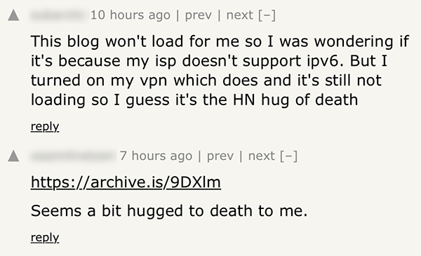
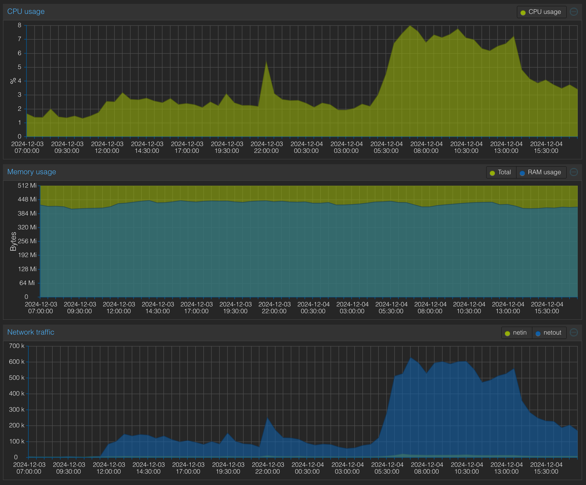

+++
title = 'Hugs of Death: How should we think about resilience in the IndieWeb?'
date = 2024-12-04T18:40:00Z
draft = false
summary = "How hard should we really be trying to optimise?"
tags = ['indieweb', 'meta']
+++

So it looks like Hacker News [found my No NAT November post from a few days ago](https://news.ycombinator.com/item?id=42313507).

I'm really glad to see from the comments that it seems to have spawned quite a bit of discussion.

But aside from all that nice constructive networking discussion there were a few posts that I, as a (mostly) self-respecting sysadmin just couldn't ignore:

Uh oh...

I was originally hosting this blog using GitHub Pages, which worked very nicely. GitHub serve their Pages content via the Fastly CDN. It would chew through the few thousand pageviews I got off the back of the HN post like they were absolutely nothing.

Unfortunately, I recently moved the blog to a VPS I have elsewhere. A single-core 512 MB VPS. It runs Caddy and, if you're accessing the site over IPv6, it's being served to you from my very own [AS215768](https://bgp.tools/as/215768).

The usage peak is pretty visible on the VPS graphs from my provder's Proxmox instance:

The start of the highest peaks of traffic on the graph definitely line up with the time the comments were posted complaining about the site being hugged to death.

Interestingly, I think it's given me quite a puzzle since the CPU usage never went above 10% even at the highest peak, and I can't find any evidence in `dmesg` of threads being killed due to OOM conditions. Perhaps due to the single-core setup, something was getting blocked long enough for users to give up waiting and navigate away. Maybe I'll have some fun digging into that.

Either way, it's clear that this little VPS couldn't handle the load of the HN post getting popular.

Instinctively I immediately started thinking about the various options available so I could make sure it didn't happen again:

> _Should I move it back to GitHub Pages?_
>
> _Maybe put it behind Cloudflare?_
>
> _Start building a load of infrastructure to support a horizontally auto-scaling Kubernetes setup?_

But I think there's a wider question to ask first.

Does it actually matter?

By the time I found the HN posts, the site was loading again. It recovered by itself without me needing to do anything. As you can see from the screenshot above, someone had posted an Archive link, so the blog was accessible the whole time to anyone who checked the comments.

In my first post, I talked about the fact that this blog is my application to [join the IndieWeb](/posts/2024-10-19-joining-the-indieweb/). The core idea of the IndieWeb is that it's a community of small independent and personal sites.

I like the fact that the IndieWeb can empower smaller creators to share their interests and creations with the world, while owning their own corner of the internet. I like the idea that the barrier to entry can be quite low, starting with something like a 512 MB VPS that someone can manage themselves. Maybe even something more DIY like a Raspberry Pi.

If there's a bit of downtime or some teething problems, or a hug of death or two, is that preferable to adopting the centralised providers like GitHub and Cloudflare as the "default", or giving newbies the idea that there's no way to publish good content without an overkill auto-scaling setup?

I had written most of this post before I remembered reading something similar quite recently and went hunting to find it. Neil Brown offers some quite similar observations in his post titled [The small web: scalability and building for realistic loads](https://neilzone.co.uk/2024/10/the-small-web-scalability-and-building-for-realistic-loads/), which is well worth a read.

There is a site I like called _Low Tech Magazine_ it [runs entirely from solar power](https://solar.lowtechmagazine.com/about/the-solar-website). It goes offline when there isn't enough sunlight to keep it going. It's quite charming in a way.

I don't really have any solid conclusions for this post. It's just some food for thought and reflects how I'm trying to think about this project differently to how I think about other projects I've worked on where 'overkill' was the name of the game.

I probably will add a second core to my VPS at least. But I'm not really rushing to do much more than that.
