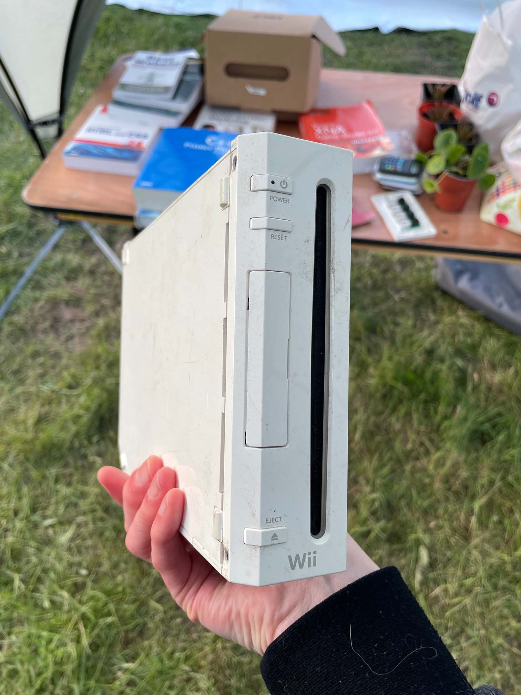
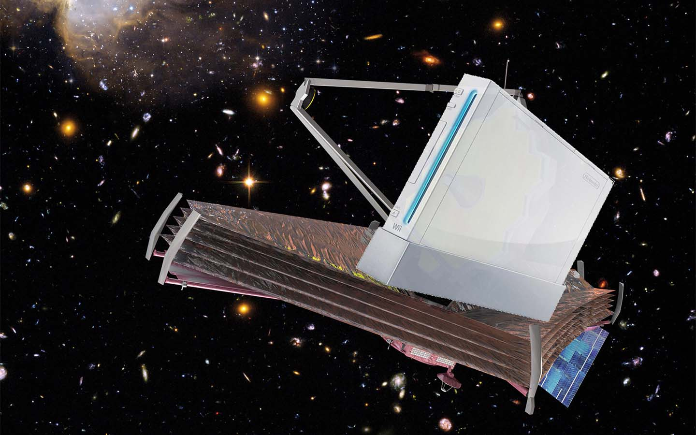
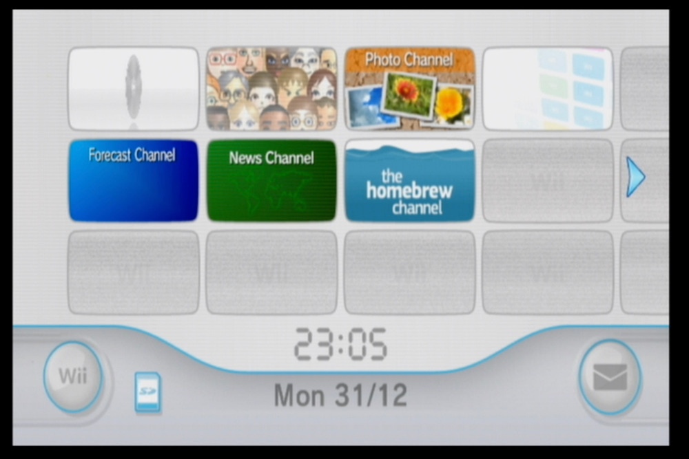
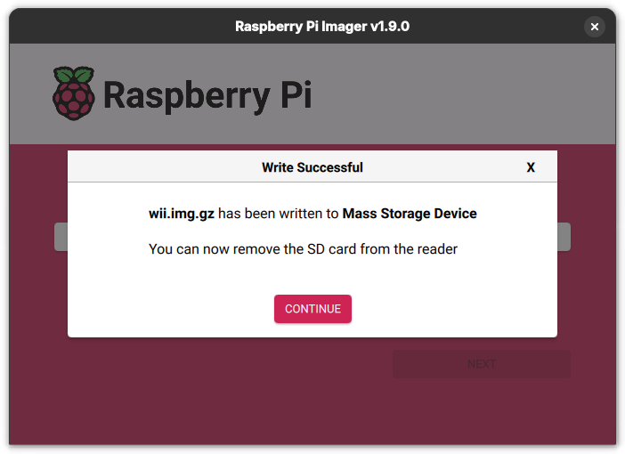
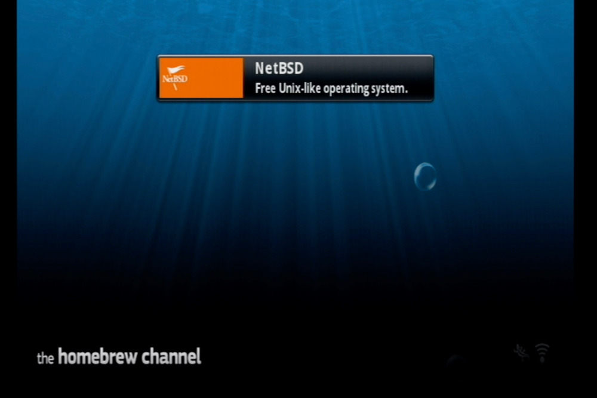
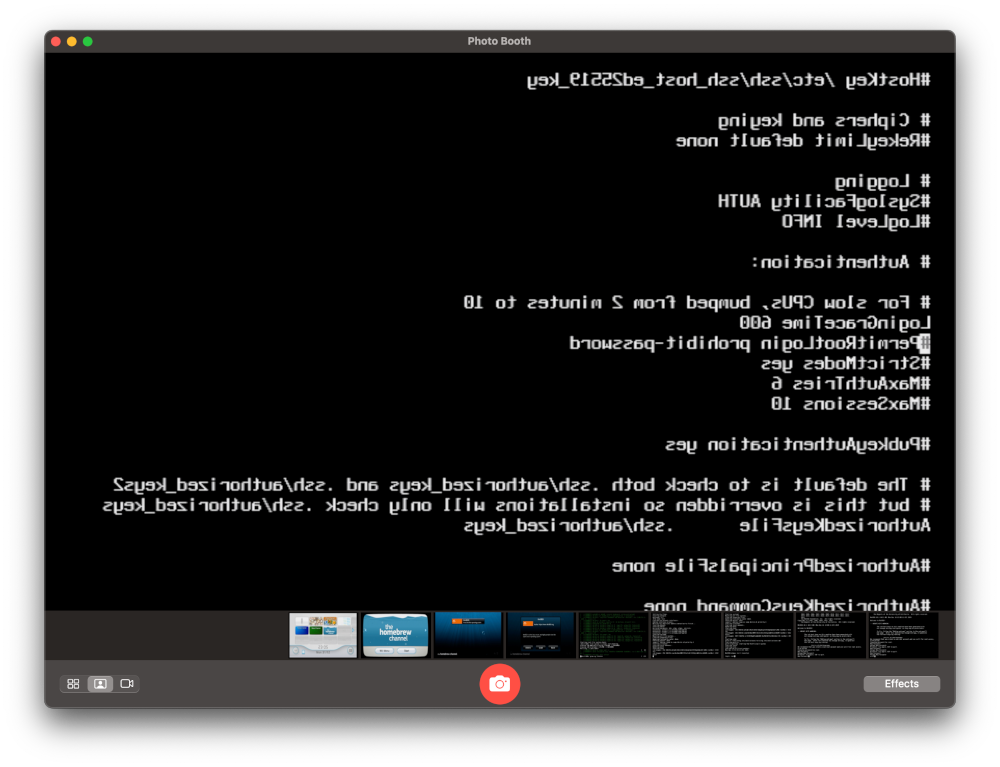
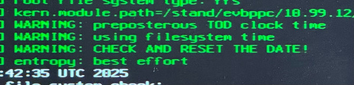
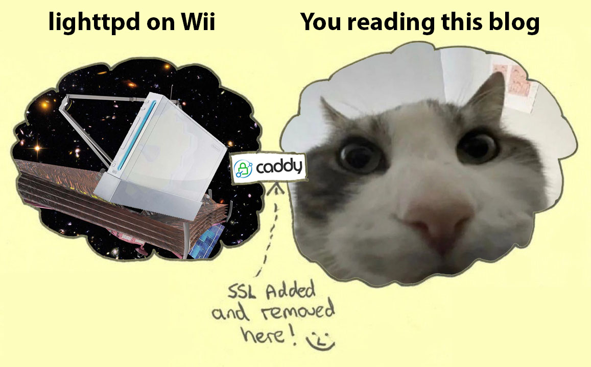

+++
title = 'This blog is hosted on a Nintendo Wii'
date = 2025-04-21T17:40:00Z
draft = false
summary = "Why not?"
tags = ['netbsd', 'shitpost']
+++


If you are reading this message, the experiment below is still ongoing. This page was served to you by a real Nintendo Wii.

You can check the Wii's [live status page](https://blog.infected.systems/status) for system load info.


For a long time, I've enjoyed the idea of running general-purpose operating systems on decidedly not-general-purpose hardware.

There's been a few good examples of this over the years, including a few which were officially sanctioned by the OEM. Back in the day, my PS3 ran [Yellow Dog Linux](https://www.destructoid.com/yellow-dog-linux-on-ps3-actually-works/), and I've been searching for a (decently priced) copy of [PS2 Linux](https://en.wikipedia.org/wiki/Linux_for_PlayStation_2) for 10+ years at this point.

There are some other good unofficial examples, such as [Dreamcast Linux](https://oldvcr.blogspot.com/2023/02/dusting-off-dreamcast-linux.html), or [PSPLinux](https://psplinux.info/files/).

But what a lot of these systems have in common is that they're now very outdated. Or they're hobbyist ports that someone got running once and where longer-term support never made it upstream. The PSP Linux kernel image was last built in 2008, and Dreamcast Linux is even more retro, using a 2.4.5 kernel built in 2001.

I haven't seen many of these projects where I'd be comfortable running one as part of an actual production workload. Until now.

While browsing [the NetBSD website](https://netbsd.org/) recently, I noticed the fact that there was a 'Wii' option listed right there on the front page in the 'Install Media' section, nestled right next to the other first-class targets like the Raspberry Pi, and generic x86 machines.

Unlike the other outdated and unmaintained examples above, clicking through to the NetBSD Wii port takes you to the latest stable NetBSD 10.1 release from Dec 2024. Even the [daily HEAD builds](https://nycdn.netbsd.org/pub/NetBSD-daily/HEAD/latest/evbppc/binary/gzimg/) are composed for the Wii.

As soon as I discovered this was fully supported and maintained, I knew I had to try deploying an actual production workload on it. That workload is the blog you're reading now.

### Finding a sacrificial Wii
Our story begins at the EMF Camp 2024 Swap Shop - your premier source for pre-loved game consoles, cardboard boxes full of 56k modems, and radioactive orphan sources.



I picked this up expecting to use it for homebrew games and emulation mostly, but I don't think it expected this fate.

### Is it fast enough?
So we have a spare Wii. And an OS with mainline support. But is a Wii actually fast enough to handle this as a production workload?

The single-core 'Broadway' CPU in the Wii is part of IBM's continued evolution of the PowerPC 750 lineup, dating all the way back to Apple's iconic 1998 Bondi Blue fishtank iMac. Although Broadway is one of the later 750 revisions, the commercially-available equivalent chip - the PowerPC 750CL - has a maximum TDP of only 9.8 W, and clocks about 33% higher than the version in the Wii.

So with a single-core chip based on a late-90s architecture and a TDP well under 10 W, it's clear that we're probably fairly contstrained here in terms of compute performance.

With that said, one of the other PowerPC 750 deployments you might be familiar with is currently floating 1,500,000 km from Earth mapping the deepest reaches of the universe in more detail than humanity has ever seen before. So if I can't get this thing serving a static website, then I think it's probably time to execute on my long-term plan of retiring from tech and opening a cat cafe.



On a more serious note, you can read about the James Wii Space Telescope's use of the PowerPC 750 [in this NASA presentation](https://ntrs.nasa.gov/api/citations/20150019915/downloads/20150019915.pdf). The 750 actually gets a lot of use in spaceflight and satellite applications because there is a radiation-hardened version available, known as the [RAD750](https://en.wikipedia.org/wiki/RAD750). Some other recent uses of the chip include both the Mars [Curiosity](https://en.wikipedia.org/wiki/Curiosity_(rover)) and [Perseverance](https://en.wikipedia.org/wiki/Perseverance_(rover)) rovers.

### Installing NetBSD on the Wii
Okay, Nintendo lawyers avert your eyes.

It had been a long time since I softmodded a Wii. I remember the [Twilight Hack](https://www.youtube.com/watch?v=4BlpONgj74A), which involved exploiting a buffer overflow in the _Twilight Princess_ save game handler to run unsigned code.

Things are much easier these days. The [Wilbrand exploit](https://wiibrew.org/wiki/Wilbrand) seems to be what people generally recommend now. Like some other exploits, it takes advantage of the fact that an SD card can be used to store and retrieve messages from the Wii Message Board. Exploting this allows unsigned code execution, which allows us to boot the [HackMii](https://www.gamebrew.org/wiki/HackMii_Installer_Wii) tool that installs the Homebrew Channel.

It's an easy mod which just requires knowing the MAC address of the console and generating a few files to load from an SD card. There's a handy browser-based tool [here](https://wilbrand.donut.eu.org/) which does all of the hard work for you.

I did have some issues using a larger SDHC card to run the Wilbrand exploit, but had the best luck with a 1GB non-SDHC card. SD card compatibility [seems to be a known issue](https://wiibrew.org/wiki/SD/SDHC_card_compatibility_tests) for Wii homebrew, but overall I'd still call the process fairly painless.

Once we've hacked the console, we should have the Homebrew Channel available in our Wii Menu:



Now we can prepare our NetBSD SD card. We do this by downloading the `wii.img.gz` image from the [front page of the NetBSD site](https://netbsd.org/).

For this card, I opted to use a fairly speedy 32GB SDHC card. The Wii doesn't support SDXC or newer cards, which means we're limited to 32GB. Larger flash devices also _generally_ tend to be faster and more resilient than smaller ones. And NetBSD seems a lot less bothered by living on a larger card than the Wilbrand exploit was. So overall I'd recommend getting a decent quality fast 32GB card if you want to try this.

We can unpack and write this image however we please, but I'm a fan of using the Raspberry Pi Imager because it'll do the work of extracting the image and verifying it post-write for us:



At this point, things are very easy. The NetBSD Wii image has all the necessary metadata & structure needed to boot directly from the Homebrew Channel as if it were any other kind of homebrew app. I think there's a lot of credit due here to [NetBSD developer Jared McNeill](https://mastodon.sdf.org/@jmcwhatever), who seems to be the main author of the Wii port.

Placing our SD card in the console and launching the Homebrew Channel is all we need to do to prepare ourselves to launch NetBSD:



Once booted into NetBSD, we can use a USB keyboard just fine, but it will be easiest to get SSH working so we can manage the system remotely. The SSH daemon is already running out-of-the-box, so the only changes we need to make are to set a password for the `root` user and then enable logging in as root by adding `PermitRootLogin yes` to the `sshd_config`.

You could set up an unprivileged user or do anything else you fancy here but I was keen to get SSH going ASAP, as due to ~~the absence of HDMI-enabled screens in my server-area~~ laziness I was doing this bit using a capture card and Photo Booth on macOS which doesn't actually support disabling the image-flip on the video feed:



If you thought it was hard to exit Vim, try doing it back to front.

After installation, I set a static network config by editing `/etc/ifconfig.axe0` and restarted the host.

On that note, I'm using the official RVL-015 Wii LAN Adapter. I went to great lengths to track down one of these for a decent price for the best chance of compatibility. On reflection, this probably wasn't needed as by the time we're booted into NetBSD we should have all of NetBSD's drivers available to us, so I expect most generic USB adapters would probably work (in theory!).

If anyone is wondering though, here are the specifics of the adapter and chipset, taken from `dmesg`:
```text
[     2.089988] axe0 at uhub2 port 1
[     2.089988] axe0: ASIX Electronics (0x0b95) AX88772 USB 2.0 10/100 ethernet controller (0x7720), rev 2.00/0.01, addr 2
[     2.549988] ukphy0 at axe0 phy 16: Asix Semiconductor AX88772 internal PHY (OUI 0x007063, model 0x0001), rev. 1
[     2.559992] ukphy0: 10baseT, 10baseT-FDX, 100baseTX, 100baseTX-FDX, auto
[     2.559992] axe0: Ethernet address 9c:e6:35:73:f0:44
```

### Package management
After restarting, I installed NetBSD's `pkgin` package manager by setting some env vars and then using `pkg_add pkgin`:

```sh
export PATH="/usr/pkg/sbin:/usr/pkg/bin:$PATH"
export PKG_PATH="https://cdn.NetBSD.org/pub/pkgsrc/packages/NetBSD/evbppc/10.1/All/"
pkg_add pkgin
```

After this, I was able to use pkgin to install a bunch of useful packages - most importantly including our `lighttpd` web server, which I've picked due to it being slim and well-suited for resource constrained environments:
```sh
pkgin install bsdfetch iperf3 lighttpd nano rsync
```

After that, I copied the basic `lighttpd` sample config, and enabled and started it:
```sh
cp -fv /usr/pkg/share/examples/rc.d/lighttpd /etc/rc.d
echo 'lighttpd=YES' >> /etc/rc.conf
/etc/rc.d/lighttpd start
```

By default, `lighttpd` is set up to serve static content from `/srv/www/htdocs`. Since my blog is a collection of static pages built with Hugo, I was able to simply `rsync` these files over and within seconds I had the system serving my site over standard HTTP.

### Is it fast enough? (addendum)
Alright, you got me. It turns out that while a PPC 750 might be enough to map the futhest reaches of the universe, a bit of soak testing suggests it does struggle a bit when trying to concurrently serve a lot of pages encrypted with modern TLS.

I tried freeing up resources by disabling a bunch of services I don't need that are running out of the box on NetBSD:
```sh
sed -i 's/^dhcpcd=.*/dhcpcd=NO/' /etc/rc.conf || echo 'dhcpcd=NO' >> /etc/rc.conf
sed -i 's/^inetd=.*/inetd=NO/' /etc/rc.conf || echo 'inetd=NO' >> /etc/rc.conf
sed -i 's/^mdnsd=.*/mdnsd=NO/' /etc/rc.conf || echo 'mdnsd=NO' >> /etc/rc.conf
sed -i 's/^postfix=.*/postfix=NO/' /etc/rc.conf || echo 'postfix=NO' >> /etc/rc.conf
```

I also disabled `ntpd`, which was using a staggering 15% of the whole system's RAM:
```text
USER PID  %CPU %MEM COMMAND
root 9161  0.0 15.6 /usr/sbin/ntpd -p /var/run/ntpd.pid -g
```

Unfortunately it seems `ntpd` is definitely necessary to keep the system clock in-check. I'm not sure whether the Wii just drifts a lot, whether it's specific to NetBSD on the Wii, or whether the clock battery in what may be a nearly 20 year old console has given up but I got some interesting and quite indignant sounding error messages after disabling this:



To compensate, I cheated by adding `ntpd -q -g` to the main `crontab`, so the system would run it hourly at `:42` min past the hour. We still get timesync, but we don't need to sacrifice a sixth of our RAM keeping it resident:

```text
42    *       *       *       *       /usr/sbin/ntpd -q -g
```

Even after freeing up the resources above, it seems like serving multiple encrypted requests in parallel was a struggle for the 750, so I opted to move the TLS termination for the blog to a Caddy instance sitting in front of the Wii.

I have Caddy acting as a reverse proxy to the Wii, handling encryption and cert management with ACME. **Importantly, there are no caching options enabled in Caddy. Every request the site serves is being serviced directly by the Wii** - including the large number of images on this post which I'll almost certainly regret adding. I optimised as much as I could, but this page is still almost exactly 1 MB when all of the content is loaded.



Through this method, I've also been able to sinkhole LLM slop-scrapers at Caddy's level, by dropping requests from [known scraper User Agents](https://github.com/ai-robots-txt/ai.robots.txt/blob/main/robots.txt) before they're forwarded to the Wii. Hopefully that might help to keep our single core chugging along without too much distress.

### Status monitoring
Moving the SSL termination to Caddy also gives me the advantage of enabling Caddy's Prometheus exporter, so I can load it into my InfluxDB + Grafana stack and monitor site load without putting a bunch of additional stress on the Wii.

But I'm still interested (and I'm sure you are too) in monitoring the general state of the Wii resources as this post goes live.

Considering I had to disable the NTP client for using too much RAM, I think running something like a Prometheus exporter directly on the Wii is right out of the window to begin with. So I put together a simple shell script that runs from the `crontab` every 15 min, outputting some system stats to a basic HTML file in the webroot.

```text
⣤⣤⣤⠀⠀⠀⠀⠀⣀⣤⣄⠀⠀⠀⠀⠀⣠⣤⣤⠀⠀⣴⣿⣦⠀⠀⢀⣶⣿⣦
⢸⣿⣿⡇⠀⠀⠀⢠⣿⣿⣿⣇⠀⠀⠀⠀⣿⣿⡿⠀⠀⠻⣿⠟⠀⠀⠈⠿⣿⠟
⠀⢿⣿⣷⠀⠀⠀⣼⣿⡿⣿⣿⡀⠀⠀⢸⣿⣿⠇⠀⠀⣀⣀⡀⠀⠀⠀⣀⣀⡀
⠀⠸⣿⣿⡆⠀⢠⣿⣿⠃⢿⣿⣇⠀⠀⣿⣿⡟⠀⠀⠀⣿⣿⣿⠀⠀⠀⣿⣿⣿
⠀⠀⢿⣿⣷⠀⣸⣿⡟⠀⠘⣿⣿⠀⢸⣿⣿⠇⠀⠀⠀⣿⣿⣿⠀⠀⠀⣿⣿⣿
⠀⠀⠸⣿⣿⣄⣿⣿⠃⠀⠀⢿⣿⣇⣿⣿⡿⠀⠀⠀⠀⣿⣿⣿⠀⠀⠀⣿⣿⣿
⠀⠀⠀⢿⣿⣿⣿⡟⠀⠀⠀⠸⣿⣿⣿⣿⠃⠀⠀⠀⠀⣿⣿⣿⠀⠀⠀⣿⣿⣿
⠀⠀⠀⠘⢿⣿⡿⠁⠀⠀⠀⠀⠻⣿⣿⠟⠀⠀⠀⠀⠀⣿⣿⣿⠀⠀⠀⣿⣿⣿

blog.infected.systems NetBSD Wii Status
Generated on: Mon Apr 21 16:30:00 UTC 2025

=== uname -a ===
NetBSD wii 10.1 NetBSD 10.1 (WII) #0: Mon Dec 16 13:08:11 UTC 2024  mkrepro@mkre
pro.NetBSD.org:/usr/src/sys/arch/evbppc/compile/WII evbppc

=== uptime ===
 4:30PM  up 25 mins, 1 user, load averages: 0.00, 0.00, 0.00
[...]
```

You can view the full status page at [blog.infected.systems/status](/status).

### Final observations
Honestly, this worked way better and was far easier than I was expecting. Naturally, there are some downsides to the setup here though.

Rebooting NetBSD reboots the whole console, and not just the NetBSD 'app', so you'll find yourself back at the Wii Menu after any kernel patch or system upgrade. Yes, this does mean that the Wiimote and sensor bar in your server cupboard are now a vital component of the production infrastructure.

I was reasonably pleased with the power consumption too. Some testing based on stats from my UPS monitoring suggest that when idling, the Wii is adding a fairly consistent ~18 W to my overall homelab usage.

By my calculations, that means I can expect the Wii to use ~13.2 kWh/month, which on my fairly expensive UK power tariff comes out to around £3.47/month - which does actually make this cheaper than most of the VPSes I can find around the obvious cloud providers. So when you're looking for your next VPS... you know what to consider.

This was a fun experiment for a rainy day over a long weekend. I'll probably keep it going for a while if it actually continues to work as well as it started. I'm often interested in applying artificial constraints to the things I deploy, as I find that's when I learn best.

Who knows, maybe I'll have been forced to become an expert in NetBSD TCP kernel tunables by this time next week...
