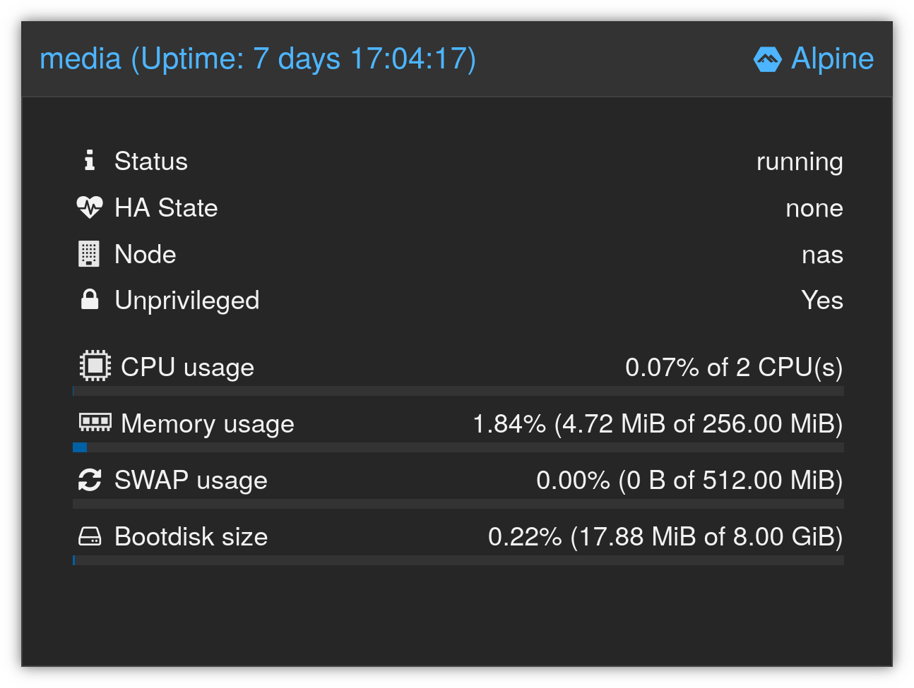

+++
title = 'The five megabyte NAS: Minimal network shares with sshfs and LXC'
date = 2025-10-14T17:52:00Z
draft = false
summary = "Creating an ultra-minimal network fileshare using Alpine Linux and SSH."
tags = ['linux', 'lxc', 'proxmox', 'networking']
+++

This is my NAS. It averages somewhere between 4 MB and 12 MB of RAM when running, and the OS fits into an on-disk footprint of less than 20 MB.



Of course this is not _quite_ the full story. This "NAS" is an LXC container on top of Proxmox, and Proxmox underneath is doing the heavy lifting of providing our kernel and managing the ZFS filesystem that's storing our content.

But before you cry clickbait -- I want this post to serve mostly as a showcase of how SSHFS can be used to create an extremely minimal network-mountable-disk setup that's usable like a regular NAS without needing to worry about heavy WebUIs, large attack surfaces, and (critically) without having to learn the dark arts of Samba permissions or NFSv4 ACLs.

In my case, this article will focus on my approach using a very minimal Alpine Linux container on top of Proxmox -- but the concepts here can be generalised to mostly any Linux or BSD setup. The only requirements are:
* Some storage somewhere on your server
* An SSH server

That's pretty much it.

### Disks and filesystems
I'll leave setting up the storage mostly out-of-scope for this post, since there's plenty of information around the web on how you might want to do this.

In general, I always use [ZFS](https://openzfs.org/wiki/Main_Page) for mass/redundant file storage, and I like the fact that Proxmox is set up natively to manage ZFS out of the box.

### Pre-requisites on server
As mentioned, the only real pre-requisite for this setup is an SSH server. I would recommend the standard OpenSSH Server for this, but other implementations might work too.

On my freshly-deployed Alpine LXC container on my Proxmox host:

```sh
apk --no-cache add apk-cron openssh-server
```

This installs the OpenSSH Server we need, along with `apk-cron`, which will (without any further config!) set up the system to automatically update packages on a daily basis.

We can start and enable the SSH service with:

```sh
rc-update add sshd && rc-service sshd start
```

Since I'm running this inside an LXC container on Proxmox, there's one more step I need to complete. This involves entering the Proxmox shell and bind-mounting a directory on the host into my container.

In this example, we're setting `mp0` (mountpoint 0) for the container with PVE ID `103` to `/zpools/media`.

```sh
pct set 103 -mp0 /zpools/media,mp=/zpools/media
```

With Proxmox, you can map a host directory to a different path within the container, but I prefer to keep things consistent to avoid confusing myself.

### SSH keys
In order to access the share, it will be most convenient to do this using SSH keys.

If you don't already have an SSH key added to your destination, you can do this with:

```sh
ssh-copy-id -i ~/.ssh/id_ed25519_NAS.pub user@nas.infected.systems
```

YMMV if you use an SSH key with a passphrase here. On a GNOME system, the methods I use for automounting work just fine with a passphrase-protected key, as long as I connect to the system manually at least once first and allow GNOME Keyring to store the passphrase to unlock the key. But passphrases on keys may become a pain-point depending on your setup.

If you have issues with GNOME, you can force enrol the key in the secret store with:

```sh
secret-tool store --label="NAS" unique ssh-store:$HOME/.ssh/id_ed25519_NAS
```

If you use a separate SSH key for the NAS, you may wish to configure it in `~/.ssh/config` for ease:

```text
Host nas.infected.systems
    IdentityFile ~/.ssh/id_ed25519_NAS
```

### Managing permissions
One of the reasons I like the SSHFS approach is that permission management can be done with standard Unix/Linux permission controls. When you mount a network share over SSHFS, you have access to whatever files the user you SSH'd into has access to. Simple!†

If you're using the same method as me -- layering a very minimal LXC container on top of a system that's already managing your storage -- you can even create further separation by simply adding more containers. Each container could have different directories bind-mounted into it, and different users/SSH keys whitelisted. This reduces the blast-radius of compromised credentials since each container can only see what's bind mounted into it, even if elevated all the way to root. Plus when they use like 5 MB RAM and 20 MB on-disk you can afford to add plenty if you like.

†Well, certainly simpler than Samba / NFSv4 ACLs, that's for sure.

### Mounting - Linux clients (via command)
To mount a SSHFS share on a Linux guest (Fedora in this example), we can do something like this:

```sh
dnf install -y sshfs
```

```sh
sshfs -o reconnect,ServerAliveInterval=5,ServerAliveCountMax=3,idmap=user "user@nas.infected.systems:/zpools/media" "${HOME}/zpools/media"
```

This mounts the network share into my home directory, using a few useful options to make the mountpoint more robust against things like network disruption or coming in/out of sleep mode:

| Option | Note |
|---|---|
| `reconnect` | Fairly obvious, but instructs the share to reconnect if needed. |
| `ServerAliveInterval=5` | Sends keepalive pings to the NAS every 5 seconds to proactively detect dead connections, reducing hangs if the NAS goes away for whatever reason. |
| `ServerAliveCountMax=3` | After three unanswered keepalives, considers the session dead and disconnects it. |
| `idmap=user` | Convert the local user's UID to the remote user's UID to ensure that files created through the mount are owned by the right user. |

### Mounting - Linux clients (via systemd)
Those who have seen my previous posts will know I'm a big fan of using systemd units wherever possible to orchestrate systems more robustly.

We can manage this by creating a systemd unit which will auto-mount the filesystem when a process tries to access anything within the mountpoint (i.e. only when needed).

First we create a systemd user directory if we don't already have one:

```sh
mkdir -p ${HOME}/.config/systemd/user
```

And then, we create a mount unit for our NAS. The name of this unit **must** correspond to the destination mountpoint on-disk as per systemd requirements:

```sh
nano "${HOME}/.config/systemd/user/home-user-zpools-media.mount"
```

And here we can create a unit with very similar settings to the command line above:

```ini
[Unit]
Description=SSHFS mount for zpools media
Wants=network-online.target

[Mount]
What=media.infected.systems:/zpools/media
Where=/home/user/zpools/media
Type=fuse.sshfs
Options=_netdev,reconnect,ServerAliveInterval=5,ServerAliveCountMax=3,idmap=user,x-systemd.automount
TimeoutSec=60

[Install]
WantedBy=default.target
```

Now we can enable and start the mount, which will ensure it starts automatically on boot:

```sh
systemctl --user daemon-reload && systemctl --user enable --now var-home-user-zpools-data-media.mount
```

Note that although the systemd mount _unit_ will start on boot, the actual network share may not fully mount until a process attempts to access something within the destination path, since we have specified `x-systemd.automount` in our `Options=` above.

### Mounting - macOS clients
On macOS, SSHFS filesystems can be mounted by installing [macFUSE](https://macfuse.github.io/) and the [official SSHFS package](https://github.com/libfuse/sshfs/releases).

macFUSE provides support for FUSE (File System in User Space) to macOS and as of macOS 26, runs entirely in user space without the need for kernel extensions.

With macFUSE and SSHFS installed, filesystems can be mounted on macOS using essentially the same command-line process shown above for Linux (the SSHFS package on Linux is built from the same codebase as the SSHFS package linked above for macOS, so it should operate the same way).

### Mounting - Apple TV clients
But SSHFS isn't only supported by desktop operating systems!

While there is no native tvOS-level support, I use a media player frontend called [Infuse](https://apps.apple.com/us/app/infuse/id1136220934?platform=appleTV) on the Apple TV, which has native SSHFS support. It works flawlessly by simply putting in the server name, username, and password.

The [VLC app for Apple TV](https://apps.apple.com/us/app/vlc-media-player/id650377962?platform=appleTV) also implements SSHFS support, but I found this to be much less reliable. It might be something to do with my IPv6-only network, I'm not sure. But you might wish to give it a go anyway.

I would expect most Apple TV clients to require password-based auth as managing SSH private keys on a TV isn't particularly something that sounds very fun. So bear in mind that you'll need `PasswordAuthentication yes` set in your SSH server config on the NAS.

### Mounting - Windows clients
I haven't really tested this so please don't consider this me vouching for the project, but apparently this can be done with SSHFS-Win:

```powershell
winget install SSHFS-Win.SSHFS-Win
```

If using WSL, you could also just install SSHFS within the WSL environment and mount there I suppose.

### Performance tweaks
SSHFS is already natively very fast, but modern SSH [tends to prefer](https://man.openbsd.org/sshd_config.5#Ciphers) the `chacha20-poly1305` cipher when negotiating connections. This seems to be good on mobile devices without AES-NI acceleration, and desktop CPUs will have no trouble with this anyway for regular SSH activity like remote shells.

But since we're intending to transfer large amounts of data through our SSH connection, it might make sense to force the server to prefer a cipher which will be accelerated by AES-NI on most desktop/laptop clients.

We can force the preference to `aes128-gcm` as follows:

```sh
echo "Ciphers aes128-gcm@openssh.com" > /etc/ssh/sshd_config.d/99-use-aes-128-ciphers.conf && rc-service sshd restart
```

Bear in mind that what we're doing here is overriding the cipher preference order set upstream by the very sensible and intelligent folk at the OpenSSH project. AES-128 is by no means weak or broken, but I'm making the assumption here that this is being done in a home environment where access is already restricted. In other scenarios, it's probably better not to touch these settings.
