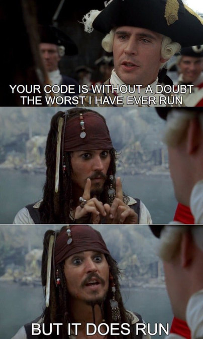

+++
title = 'Force-updating Podman inside GitHub Actions'
date = 2025-12-18T22:00:00Z
draft = false
summary = "Let's create a Frankenbuntu!"
tags = ['linux', 'podman', 'ubuntu']
+++

I've recently been building a number of containers based on the very interesting [StageX](https://stagex.tools/) project.

Many of the public StageX recipes and examples make heavy use of [the heredoc syntax](https://blog.podman.io/2024/08/heredoc-is-here-for-containerfiles-in-podman/) for easier to read Containerfiles without creating unnecessary additional layers.

## Useful features in newer Podman versions
You may have different reasons for wanting a newer Podman version, but for me it's this heredoc functionality.

The heredoc syntax can make things much easier to read, without needing to create unnecessary layers, or ending up with `&& \` littered all throughout your Containerfile.

Here's a nice example:
```dockerfile
FROM docker.io/library/alpine:latest

RUN <<EOF
apk --no-cache add alpine-sdk
apk --no-cache add gcc
apk --no-cache add golang
EOF
```

It also supports inline build arguments, which is pretty neat:
```dockerfile
FROM docker.io/library/alpine:latest

RUN --network=none <<EOF
make -j4
make install
EOF
````

Support for heredoc syntax was added to `podman build` [in Podman v4.8.0](https://github.com/containers/podman/releases/tag/v4.8.0), so _in theory_ it should be supported by the default Ubuntu 24.04 GitHub Actions runners which ship Podman 4.9.3, right?

Unfortunately, no. It seems like heredoc support was [patched out upstream](https://salsa.debian.org/go-team/packages/golang-github-containers-buildah/-/blob/8215d51369a8c8f4f85ec725de111a5cbffd50ae/debian/patches/avoid-buildkit-heredoc.patch) in Debian. This patch is still in the version of `buildah` that ships in Ubuntu 24.04 today. And this is the version we get when we use the public GitHub Actions runners with `ubuntu-latest`.

The commit message suggests:

> "This is to avoid a dependency on buildkit, can probably be dropped after [#1051202](https://bugs.debian.org/cgi-bin/bugreport.cgi?bug=1051202)"

With `podman` and `buildah` being Ubuntu Universe packages, and Ubuntu 26.04 on the horizon, I don't think Canonical are particularly motivated to fix this one.

We're also a bit stuck with Ubuntu, since it's [the only Linux distro](https://docs.github.com/en/actions/reference/runners/github-hosted-runners) available on GitHub's free public runners.

## Forcing Podman to update

To solve this, we can do something slightly cursed and ill-advised (but which does work!).

Adding this step to an Actions workflow allows us to bring in the Podman package from 25.04 instead, along with the necessary dependencies to ensure that enough of the Podman runtime gets updated for things to actually work:

```yaml
- name: Install Podman from Ubuntu 25.04
  run: |
    sudo sh -c 'echo "deb http://archive.ubuntu.com/ubuntu plucky main universe" > /etc/apt/sources.list.d/plucky.list'
    sudo apt update
    sudo apt install -y podman conmon crun runc
```

You can see an example of a full Actions workflow with this fix [in my NekOS repo here](https://github.com/alexhaydock/NekOS/blob/bd84d1c02a2852af356992107ed8d414eafe4bcc/.github/workflows/build.yml).

No doubt the other packages that get updated when we do this may break in various subtle ways if you're doing anything other than building Podman containers in your Actions workflow. But if you _are_ just building Podman containers, this is probably the easiest way of getting newer Podman versions.

There are also probably cleaner options available -- like building the latest Podman and supporting packages from source, or forcing the runner to complete a full Ubuntu version upgrade during the Actions run -- but I discounted both as taking too much time and effort.

With that in mind, I'm coining the term [Frankenbuntu](https://wiki.debian.org/DontBreakDebian#Don.27t_make_a_FrankenDebian) for this one, and officially advising you not to do it. But it does work...


